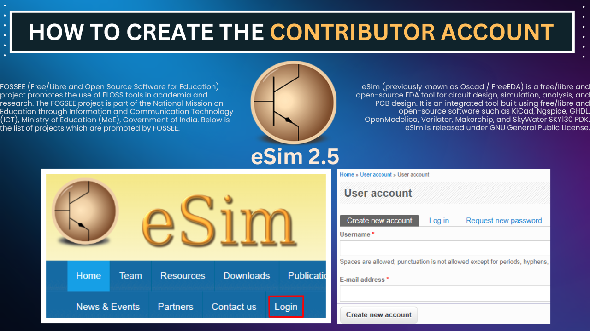
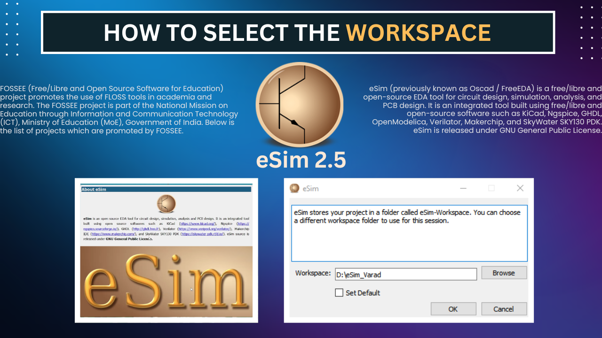
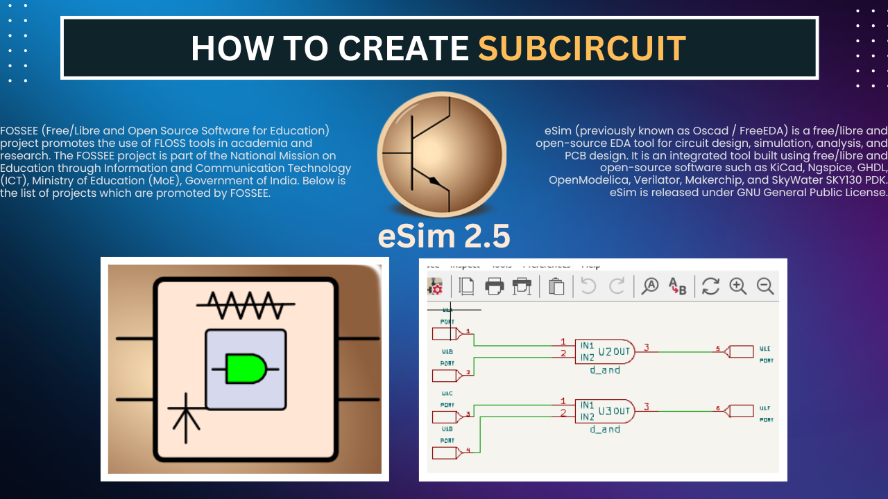
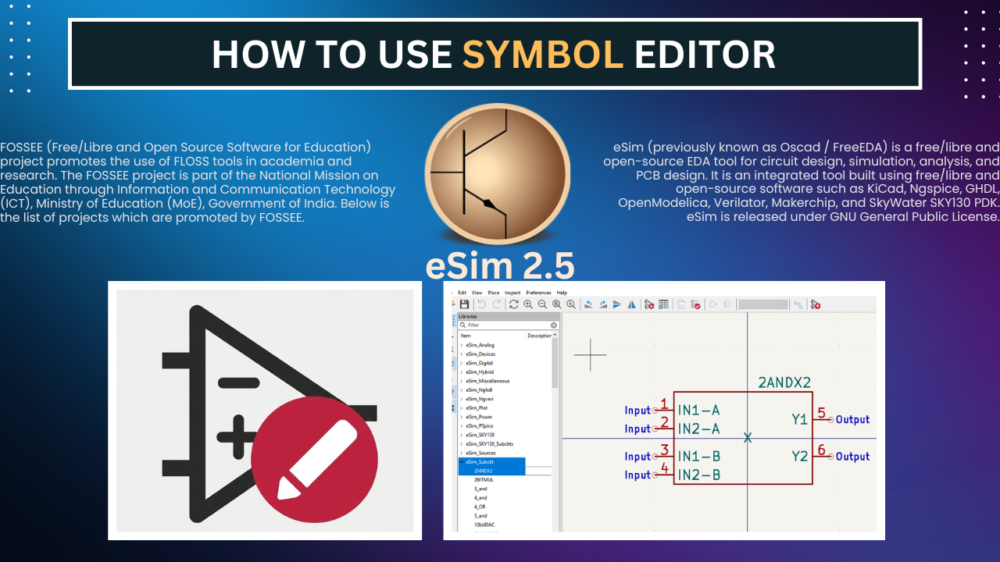
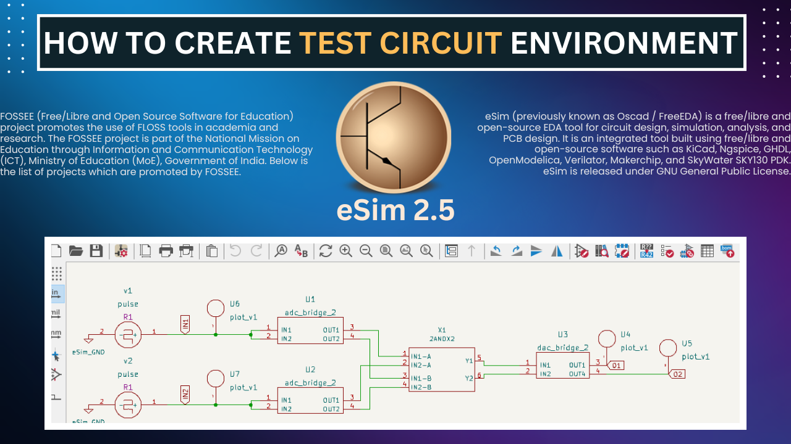
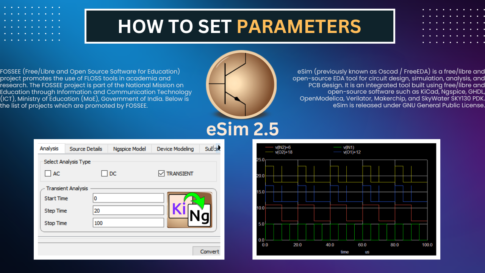
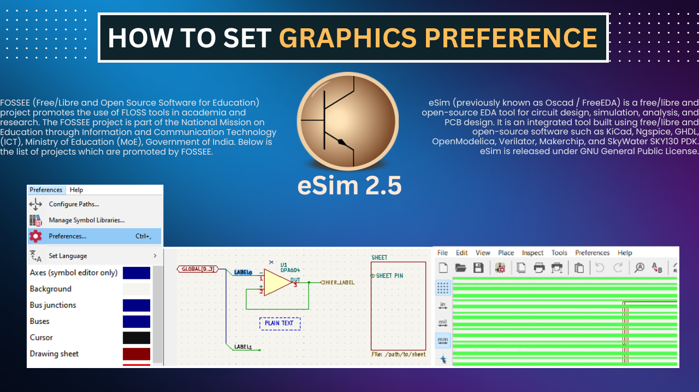

<h1 align="center">eSim EDA Query Solutions</h1>
<h3 align="center">Solutions for Common eSim User Queries</h3>

---

## About

This repository contains **Solutions to common queries related to eSim EDA**.  
Each solution is organized into folders based on the topic or issue.

The purpose of this repository is to make it easier for users to **find explanations and troubleshooting guides** through short demonstration videos.

---

## Topics Covered

<table>
<tr>

<td align="center">

 <b>How to Create a Contributor Account</b>
</td>

<td align="center">

 <b>How to Select the Workspace</b>
</td>

<td align="center">

 <b>How to Create a Subcircuit</b>
</td>

</tr>

<tr>

<td align="center">

 <b>How to Use the Symbol Editor</b>
</td>

<td align="center">

 <b>How to Create a Test Circuit Environment</b>
</td>

<td align="center">

 <b>How to Set Parameters</b>
</td>

</tr>

<tr>

<td align="center">

 <b>How to Set Graphic Preferences</b>
</td>

<td></td>
<td></td>

</tr>
</table>

---

New query solutions will be added over time.
